# 1.Hướng dẫn sử dụng AWX 

*AWX là một phần mềm cung cấp giao diện web cho người dùng, REST API và các công cụ thực thi dựa trên Ansible. Đây là một upstream project cho phần mềm Ansible Tower của RedHat*

- Các thành phần:
	- AWX
	- Nginx (webserver)
	- Postgres (database-server)
    - Redis (cache)
# 2.Hướng dẫn cài đặt AWX

*Hướng dẫn cài đặt AWX trên container cho centos7*

- Bước 1: Cài đặt epel-repository để có thể download đầy đủ các gói phần mềm
```sh
yum install -y epel-release
```

- Bước 2: Cài đặt Docker 
```sh
 sudo yum install -y yum-utils device-mapper-persistent-data lvm2
 
 sudo yum-config-manager --add-repo https://download.docker.com/linux/centos/docker-ce.repo
 
 sudo yum install docker-ce
 
 sudo usermod -aG docker $(whoami)
 
```

- Bước 3: Khởi động Docker
```sh
 sudo systemctl enable docker.service
 
 sudo systemctl start docker.service
```


- Bước 4: Clone script cài đặt AWX từ github 
```sh
git clone --depth 50 https://github.com/ansible/awx.git
```

- Bước 5: Đứng tại thư mục cài đặt AWX
```sh
cd awx/installer
```

- Bước 6: Đổi password truy cập trong file `inventory`:
```sh
sed -i 's|admin_password=.*|admin_password=adminpassword|g' inventory
```

- Bước 7: Tiến hành cài đặt AWX bằng cách chạy playbook của ansible 
```sh
ansible-playbook -i inventory install.yml
```

*Chờ cho đến khi chạy xong playbook và không có task nào bị `failed`*

- Bước 8: Kiểm tra sau khi cài đặt

	- *Thực hiện lệnh docker ps -a để check các container đã chạy*:

	

	- *Truy cập AWX thông qua địa chỉ host của bạn*: 
	
	


- Bước 9: Điền thông tin mật khẩu đã khai báo ở bước 6


- Kết quả: 


# 3. Hướng dẫn sử dụng AWX 


*Ở đây hướng dẫn thực hiện chạy một playbook trên AWX*

## 3.1 Tạo nội dung inventory

- Bước 1: Chọn mục inventory
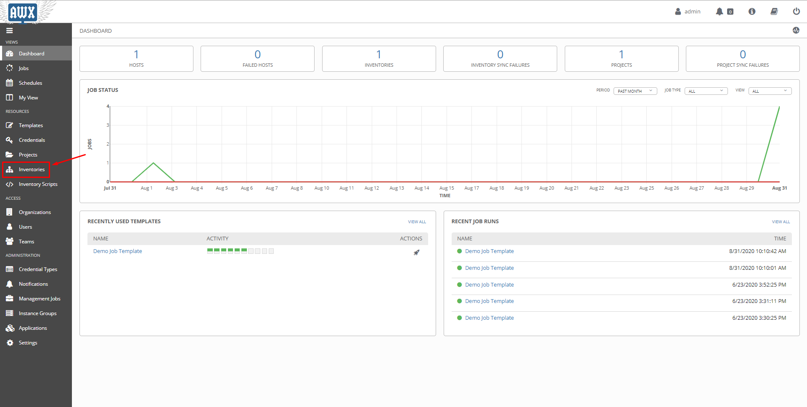


- Bước 2: Add thêm inventory

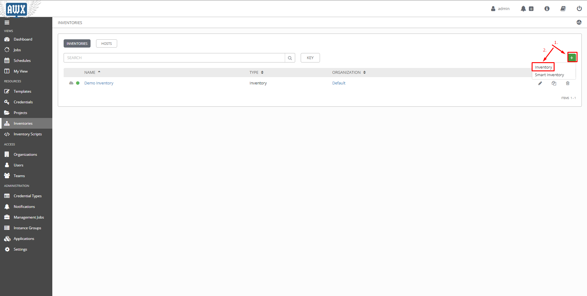


- Bước 3: Khai báo thông tin về tên cho inventory

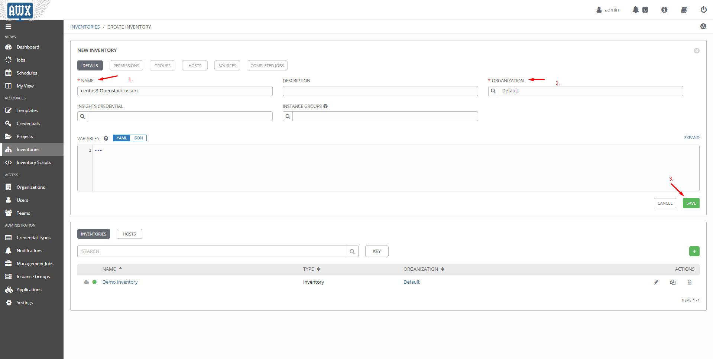

- Bước 4: Tạo group trong inventory đó

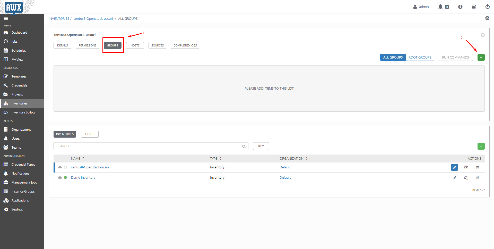

- Bước 5: Khai báo thông tin cho group ( có thể tạo nhiều group )


- Bước 6: Tạo các hosts trong group chỉ định


- Bước 7: Khai báo thông tin các host (bao gồm: hostname địa chỉ ip , host_vars của host đó rồi add vào group )

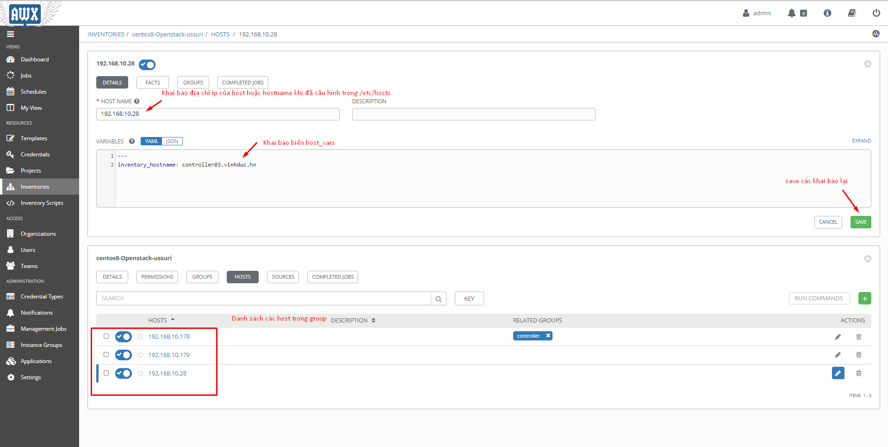


## 3.2 Khai báo xác thực đến các hosts trong inventory


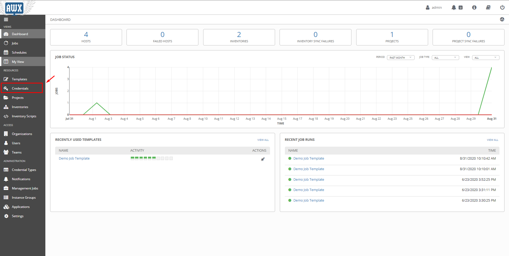

- Bước 1: Add thêm 1 nội dung xác thực cho các host trong  file inventory

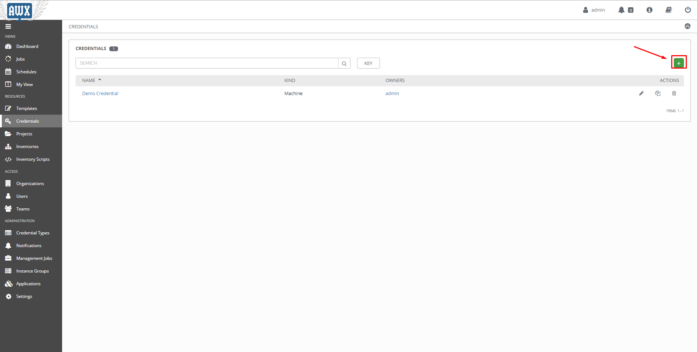


- Bước 2: Khai báo thông tin xác thực


## 3.3 Kiểm tra kết nối của Ansible


- Bước 1: Chọn các host sẽ thực hiện ad-hoc command

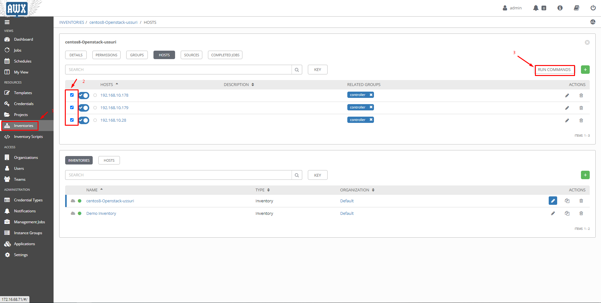

- Bước 2: Thực hiện chọn module `ping` để kiểm tra kết nối của Ansible đến các hosts, chọn xác thực đã tạo

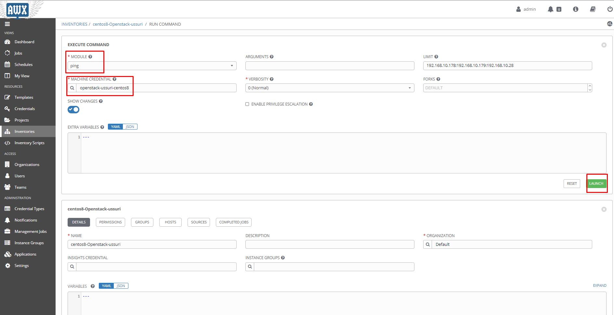

- Kết quả: `Successfull`

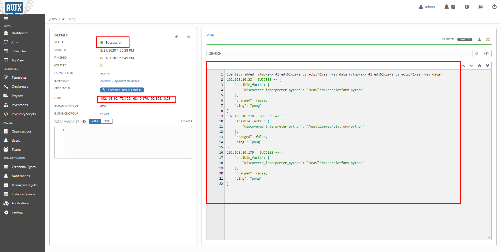


## 3.4 Thực hiện tạo project để chạy Playbook

- Bước 1 : Tạo mới 1 project

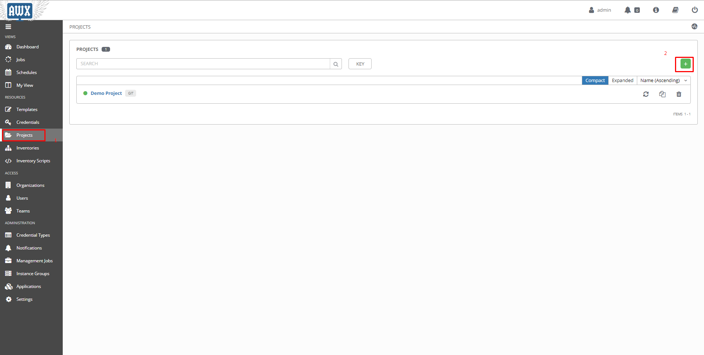


- Bước 2: Khai báo thông tin cho project, chọn clone 1 project từ github ( hiện tại chưa thể dùng manual vì đang cài AWX trên môi trường Docker- chưa mount thư mục )

*https://github.com/vinhducnguyen1708/ansible-tower-samples*


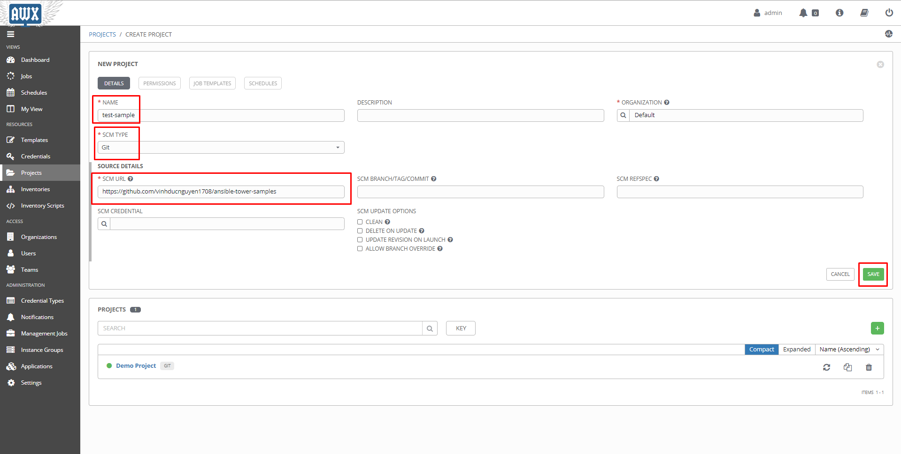

- Bước 3: Tạo job 

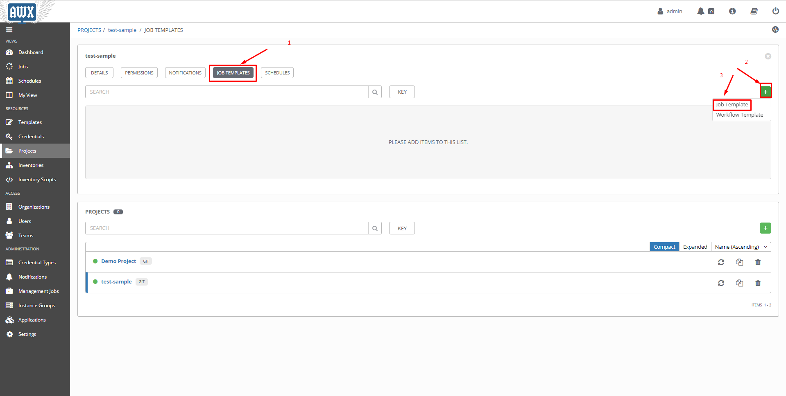


- Bước 4: Khai báo thông tin Job

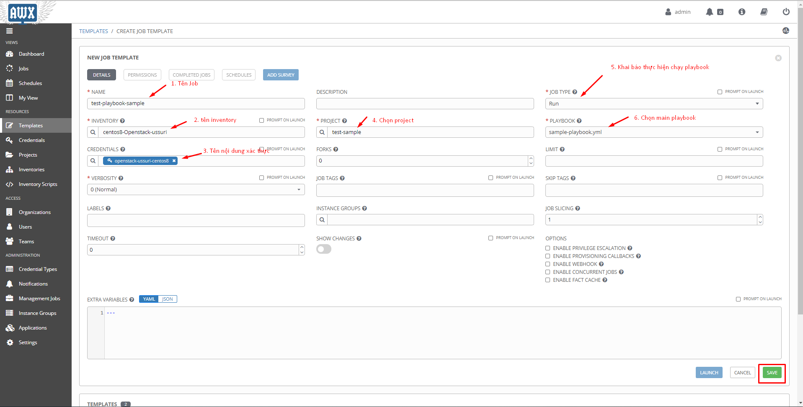


- Bước 5: Thực hiện chạy playbook

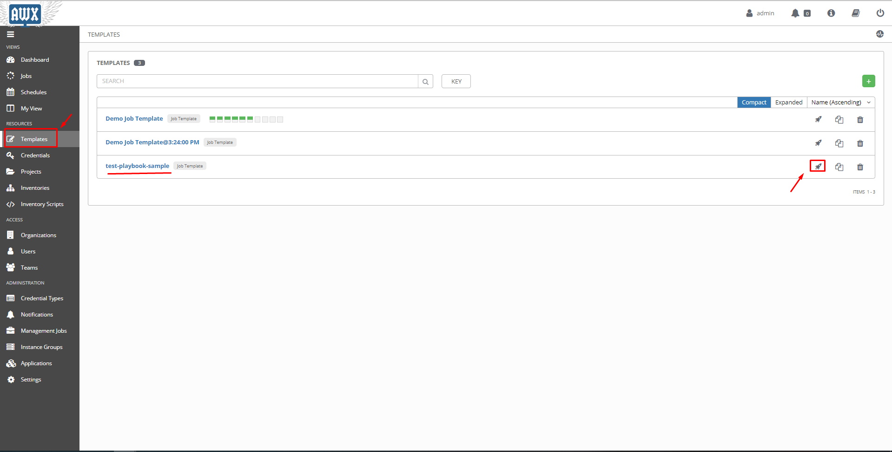

- Kết quả:

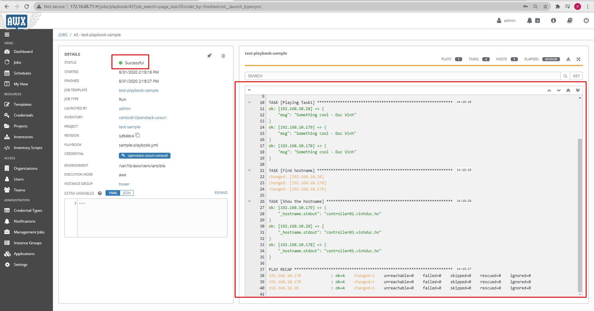
